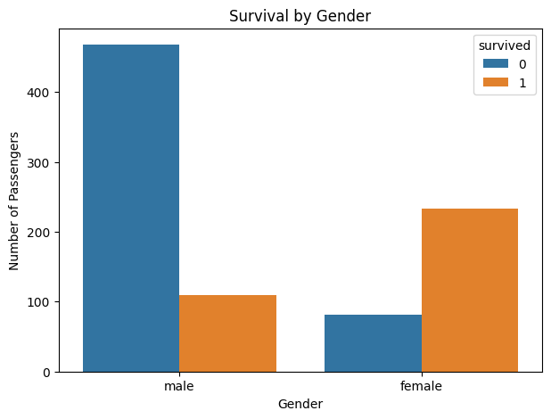
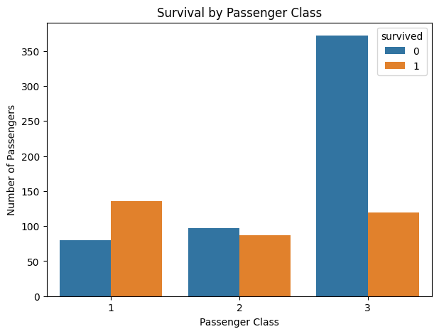
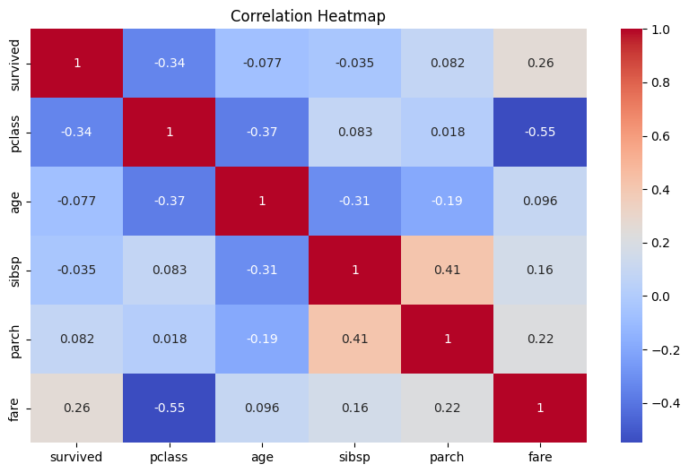

# 🚢 Titanic Data Cleaning & Exploratory Data Analysis

This project performs **Exploratory Data Analysis (EDA)** on the Titanic dataset using Python. The analysis focuses on understanding the dataset, identifying data quality issues, exploring patterns, and finding relationships between passenger characteristics and survival.

## 🛠️ Tools & Technologies

* Python
* Pandas
* Matplotlib
* Seaborn
* Google Colab / Jupyter Notebook

## 📂 Project Files

* `CodeAlpha_EDA.ipynb` — Complete EDA notebook
* `titanic.csv` — Original Titanic dataset
* `titanic_eda_dataset.csv` — Cleaned dataset
* `Survival-by-gender.png` — Survival comparison by gender
* `Survival-by-passenger-class.png` — Survival comparison by passenger class
* `Correlation-Heatmap.png` — Correlation heatmap

## ❓ Meaningful Questions

The analysis was guided by questions such as:

* Does survival differ between male and female passengers?
* Does passenger class have a relationship with survival?
* What patterns can be observed in the numerical variables?
* Are there correlations between important numerical features?
* Are there any missing values or other data quality issues?

## 🔍 Data Exploration

The dataset was explored to understand:

* Number of rows and columns
* Column names
* Data types
* Missing values
* Duplicate records
* Distribution of important variables

## 🧹 Data Cleaning

Potential data issues were identified and addressed before analysis.

The cleaning process included:

* Checking missing values
* Handling missing data
* Checking duplicate records
* Reviewing data types
* Removing or handling unnecessary information
* Preparing the cleaned dataset for analysis

## 📊 Exploratory Data Analysis

Different visualizations were created to identify trends, patterns, and relationships in the dataset.

### Survival by Gender

This visualization compares survival outcomes between male and female passengers.

### Survival by Passenger Class

This visualization compares survival outcomes across different passenger classes.

### Correlation Heatmap

The correlation heatmap is used to examine relationships between numerical variables.

## 🧪 Hypothesis & Validation

The analysis examined whether passenger **gender** and **class** were associated with survival outcomes.

These assumptions were explored using:

* Grouped survival comparisons
* Statistical summaries
* Data visualizations
* Correlation analysis

The visualizations help validate whether noticeable patterns exist in the dataset.

## 📌 Key Findings

* Survival outcomes differed between male and female passengers.
* Passenger class showed differences in survival outcomes.
* Numerical variables showed different levels of correlation with each other.
* Missing values and other data quality issues were identified during the exploration process.

## 🎯 Learning Outcomes

Through this project, I practiced:

* Exploring datasets using Pandas
* Understanding variables and data types
* Identifying missing values and data issues
* Cleaning data
* Asking meaningful analytical questions
* Creating visualizations using Matplotlib and Seaborn
* Identifying trends and patterns
* Using statistics and visualization to validate observations
* Performing Exploratory Data Analysis (EDA)

## 👩‍💻 Author

**Alisha Noor**

Software Engineering Student | Aspiring Data Analyst

